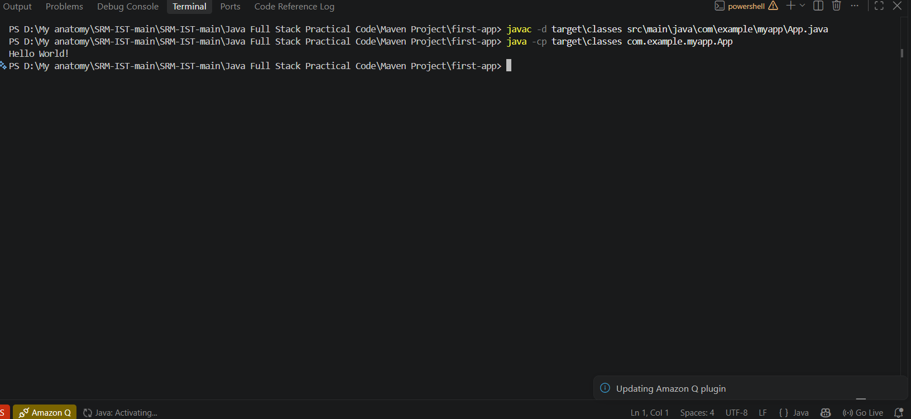

# First App – Java Maven Project

## 1. Project Overview

The **First App** is a basic Java application created using the Maven project structure. It demonstrates the execution of a simple Java program that prints `Hello World!` in the VS Code terminal.

This project is a beginner-level application used to understand Java source files, package structure, compilation, and execution through the command line.

---

## 2. Technologies Used

- **Programming Language:** Java
- **Project Structure:** Maven
- **IDE:** Visual Studio Code
- **JDK Version Used:** Java 25
- **Execution Environment:** PowerShell Terminal

---

## 3. Project Structure

```text
first-app/
│
├── src/
│   ├── main/
│   │   └── java/
│   │       └── com/
│   │           └── example/
│   │               └── myapp/
│   │                   └── App.java
│   │
│   └── test/
│
├── target/
├── pom.xml
└── README.md
```

### Main Source File

```text
src/main/java/com/example/myapp/App.java
```

The `App.java` file contains the main method and prints the message `Hello World!` to the terminal.

---

## 4. Requirements

The following software is required:

1. Java Development Kit (JDK)
2. Visual Studio Code
3. Java Extension Pack for VS Code (recommended)

Verify Java installation using:

```powershell
java -version
```

Example:

```text
java version "25" 2025-09-16 LTS
```

---

## 5. Execution in Visual Studio Code

### Step 1: Open the Project

Open the `first-app` folder in Visual Studio Code.

Open the integrated terminal using:

```text
Ctrl + `
```

Make sure the terminal is located inside the folder containing `pom.xml`.

Example:

```text
...\Java Full Stack Practical Code\Maven Project\first-app
```

### Step 2: Compile the Java Program

Run the following command in the PowerShell terminal:

```powershell
javac -d target\classes src\main\java\com\example\myapp\App.java
```

#### Command Explanation

- `javac` compiles the Java source file.
- `-d target\classes` specifies the folder where compiled `.class` files will be stored.
- `src\main\java\com\example\myapp\App.java` specifies the location of the Java source file.

If compilation is successful, the command does not display an error message.

### Step 3: Execute the Java Program

Run the following command:

```powershell
java -cp target\classes com.example.myapp.App
```

#### Command Explanation

- `java` runs the compiled Java program.
- `-cp target\classes` specifies the classpath containing the compiled files.
- `com.example.myapp.App` is the fully qualified class name.

### Expected Output

```text
Hello World!
```

---

## 6. Commands Used

The following commands were used to execute the project:

### Check Java Version

```powershell
java -version
```

### Compile the Program

```powershell
javac -d target\classes src\main\java\com\example\myapp\App.java
```

### Run the Program

```powershell
java -cp target\classes com.example.myapp.App
```

> Note: Maven was not used for the final execution because Maven was not configured in the system PATH. The application was compiled and executed directly using the Java compiler (`javac`) and Java runtime (`java`).

---

## 7. Screenshots

Screenshots can be attached below to document the execution process.

### Screenshot 1: Project Structure in VS Code

Attach a screenshot showing the `first-app` project structure, including `src`, `target`, and `pom.xml`.

```text
[Attach Screenshot Here]
```

Suggested file name:

```text
screenshots/project-structure.png
```

### Screenshot 2: Compilation Command

Attach a screenshot showing the successful compilation command in the VS Code terminal.

```text
[Attach Screenshot Here]
```

Suggested file name:

```text
screenshots/compilation-command.png
```

### Screenshot 3: Program Execution

Attach a screenshot showing the execution command and the output:

```text
Hello World!
```

```text
[Attach Screenshot Here]
```

Suggested file name:

```text
screenshots/hello-world-output.png
```

---

## 8. Working Principle

1. The Java source file `App.java` contains the main method.
2. The `javac` command compiles the source code into bytecode.
3. The compiled `.class` files are stored in the `target\classes` directory.
4. The `java` command executes the compiled class.
5. The program displays `Hello World!` in the terminal.

---

## 9. Result

The First App Java project was successfully compiled and executed in Visual Studio Code using the Java compiler and Java runtime commands. The program displayed the expected output:

```text
Hello World!
```

---

## 10. Conclusion

This project demonstrates the basic process of compiling and running a Java application in Visual Studio Code. It also provides an introduction to Java package structure, Maven project organization, terminal commands, and standard output.

